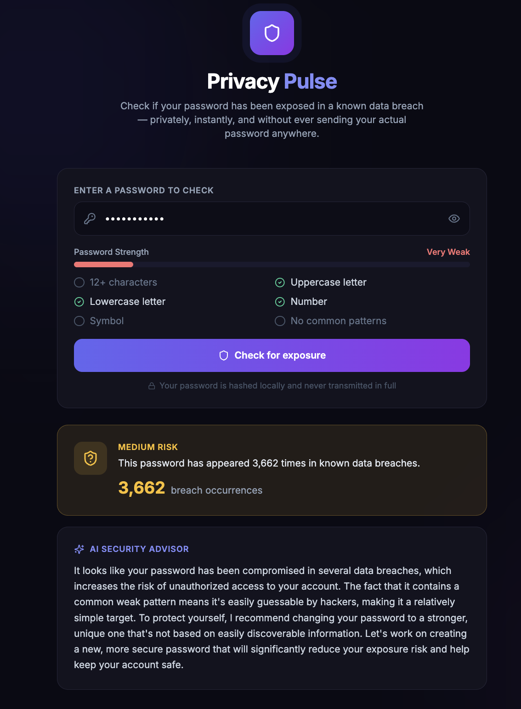

<div align="center">

# 🛡️ Privacy Pulse

**Check if your password has been exposed in a data breach — privately, instantly, for free.**

[](https://react.dev)
[](https://fastapi.tiangolo.com)
[](https://groq.com)
[](LICENSE)

[**Live Demo →**](https://your-app-url.com) &nbsp;·&nbsp; [Report Bug](issues)

</div>

---

## What it does

Most people reuse passwords across dozens of accounts with no idea whether any of them have already leaked in a known data breach. Privacy Pulse checks instantly — without ever transmitting your actual password anywhere, then uses an LLM to translate the raw exposure data into plain-English, actionable advice.

```
User types a password
        ↓
Password is hashed locally (SHA-1)
        ↓
Only first 5 hash characters sent to Pwned Passwords API (k-anonymity)
        ↓
Exposure count + local strength analysis computed
        ↓
Groq LLM generates personalized, calm security advice
        ↓
Results displayed — risk level, strength meter, AI guidance
```

---


## Why this matters

Password breach checkers exist, but most either require giving up your real password to a third party, bury the result in jargon, or stop at "exposed: yes/no" with no guidance on what to actually do next. Privacy Pulse closes that gap — and costs nothing to run.

---

## Privacy by design

This is the core design constraint of the whole project: **the real password never leaves your browser session in a recoverable form.**

- Password is SHA-1 hashed before any network call
- Only the first 5 characters of the hash are sent (k-anonymity model)
- The Pwned Passwords API returns all hash suffixes matching that 5-char prefix
- Matching happens locally on the backend — the full password is never reconstructible by any third party

This is the same privacy-preserving technique used by browser built-in breach checkers (Chrome, Firefox).

---

## Tech stack

| Layer | Tool | Why |
|---|---|---|
| Frontend | React 18 + Vite + Tailwind | Fast dev loop, clean component model |
| Backend | FastAPI (Python) | Async-native, automatic OpenAPI docs |
| Breach data | [Pwned Passwords API](https://haveibeenpwned.com/Passwords) | Free, no API key, k-anonymity privacy model |
| AI advice | Groq (Llama 3.3 70B) | Free tier, fast inference, no card required |
| Strength analysis | Custom local logic | Zero external dependency, instant feedback |

**Total cost to run: $0.** Every component uses a free tier or open API.

---

## Project structure

```
privacy-pulse/
├── backend/
│   ├── main.py              # FastAPI app — all routes and logic
│   ├── requirements.txt
│   └── .env.example
├── frontend/
│   ├── src/
│   │   ├── App.jsx          # Main UI component
│   │   ├── main.jsx
│   │   └── index.css
│   ├── package.json
│   ├── vite.config.js
│   └── tailwind.config.js
└── README.md
```

---

## Quick start

### Backend

```bash
cd backend
pip install -r requirements.txt

# Add your free Groq API key
cp .env.example .env
# Edit .env and add GROQ_API_KEY (get one free at console.groq.com)

uvicorn main:app --reload --port 8000
```

### Frontend

```bash
cd frontend
npm install
npm run dev
```

Open `http://localhost:5173` — the Vite dev server proxies `/api` calls to the FastAPI backend automatically.

---

## API reference

### `POST /api/check-password`
Checks password exposure against known breaches.

**Request:**
```json
{ "password": "yourpassword" }
```

**Response:**
```json
{
  "exposed": true,
  "times_seen": 3730471,
  "risk_level": "Critical",
  "message": "This password has appeared 3,730,471 times in known data breaches.",
  "ai_advice": "This password is extremely common in breach datasets..."
}
```

### `POST /api/password-strength`
Local-only strength analysis, no external API call.

**Response:**
```json
{
  "checks": { "length_ok": true, "has_upper": true, ... },
  "strength": "Strong",
  "score": 5,
  "is_common_pattern": false
}
```

---

## Design decisions

**Why k-anonymity instead of a simple lookup?**
Sending a full password (even hashed) to a third party for comparison is a security anti-pattern. The k-anonymity model means the API operator never sees enough information to identify which specific password was checked — only "some password starting with hash prefix X was queried," among thousands of others sharing that prefix.

**Why Groq instead of OpenAI/Anthropic?**
Groq's free tier requires no credit card and offers fast inference on Llama 3.3 70B, which is more than capable for generating short, contextual security advice. This keeps the entire project's operating cost at zero — important for a portfolio piece meant to be freely demoable.

**Why FastAPI over Flask/Django?**
Native async support matters here — the app makes an external HTTP call (to Pwned Passwords) on every request, and async I/O keeps the server responsive under concurrent load without extra tooling.

---

## What I'd build next

- [ ] Browser extension version for real-time checking while typing on any site
- [ ] Batch-check a list of passwords (e.g., from a password manager export)
- [ ] Historical breach timeline if the email-based lookup is added later (requires a paid HIBP tier)
- [ ] Dark/light theme toggle
- [ ] Rate limiting + caching layer to reduce redundant API calls

---

## Author

**Sushmitha Katherine Jayaraj**
Data Engineer & Analytics/ML Graduate Student, Northeastern University

[LinkedIn](https://linkedin.com/in/sushmitha-katherine-69387b189/) · [GitHub](https://github.com/sushmitha-lab)

---

<div align="center">
<sub>Built with React · FastAPI · Groq · Pwned Passwords API</sub>
</div>
